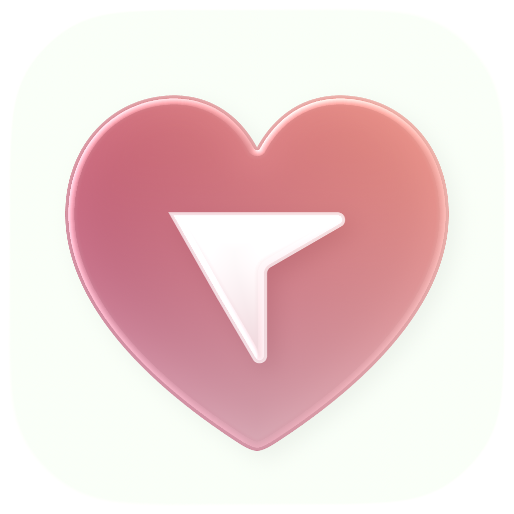

<p align="center">
  
</p>

<h1 align="center">TendonTally</h1>

<p align="center">
  TendonTally is a native macOS menu bar app that turns computer activity into a clear workload signal.
</p>

<p align="center">
  <a href="https://tendontally.com">Website</a>
  ·
  <a href="https://github.com/Krecharles/tendon-tally/releases/latest">Releases</a>
  ·
  <a href="https://github.com/Krecharles/tendon-tally/releases/latest/download/TendonTally.dmg"><strong>Download Latest DMG</strong></a>
</p>

<p align="center">
  <a href="https://github.com/Krecharles/tendon-tally/releases/latest/download/TendonTally.dmg">
    
  </a>
  <a href="https://github.com/Krecharles/tendon-tally/releases/latest">
    
  </a>
</p>

## What it does

- Tracks key presses, mouse clicks, scroll activity, and mouse movement distance
- Uses rolling 1-minute windows for live activity feedback
- Shows a quick menu bar dashboard and a full dashboard view
- Includes Today and History views for trend tracking over time
- Includes optional break reminders with configurable work/break timing and snooze options
- Data stays local on your Mac

## Run from source

Requirements: macOS 14+, Swift 5.9+, Xcode Command Line Tools.

```bash
swift build
swift run TendonTally
# or
./run.sh
```

When first launched, macOS will ask for Accessibility/Input Monitoring permissions so activity can be measured.
